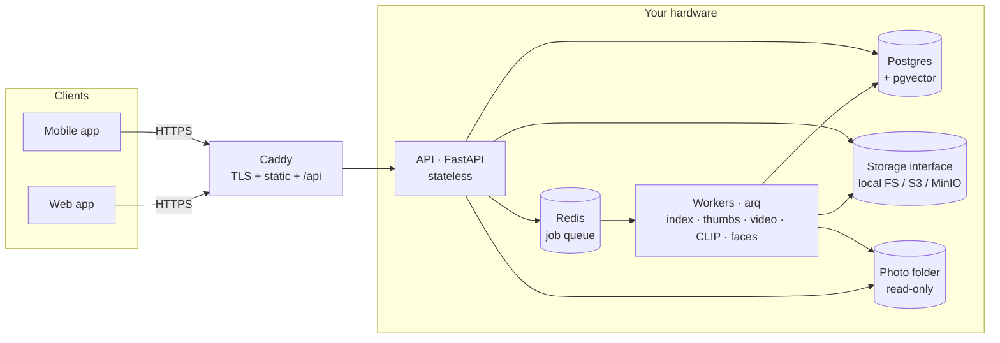

# PhotoNest

[](https://github.com/Db2203/selfhost/actions/workflows/ci.yml)

A self-hosted photo library — like Google Photos, but the photos live on **your** hardware.
Index the photos on your machine, browse the unified library securely from any device, and
search it with natural language.

> **Privacy by design:** your photos never leave your hardware, and all AI runs locally.

## Why

Cloud photo services mean handing your memories to someone else's servers. PhotoNest keeps
everything on a machine you control (a laptop now, a NAS later) while still giving you the
things that make cloud galleries nice: cross-device access, fast browsing, face grouping,
and "show me photos of the beach" search.

## Features

- [x] Secure, authenticated access — per-device login, nothing served to anonymous clients
- [x] Index a local photo folder (EXIF, HEIC, content-hash dedup) without touching originals
- [x] Fast web gallery (timeline, lightbox, infinite scroll)
- [x] Natural-language search (CLIP embeddings + pgvector similarity search)
- [x] Face recognition & people grouping (name and merge people; names survive re-scans)
- [x] Android app with camera-roll backup (safe to re-run; deduplicated server-side)
- [x] iOS support (same Expo app)
- [x] Scale-out storage (S3/MinIO behind a storage interface) and remote access (Tailscale)
- [x] Videos: poster thumbnails, one-time HEVC→H.264 transcode, seekable streaming (web + mobile)
- [x] Library management: favorites, albums, and delete that survives re-indexing (tombstones)

## Architecture



**The decisions that matter:**

- **Central-server model.** The host is the source of truth; clients upload to it and browse
  the unified library. No peer-to-peer sync, no conflict resolution.
- **Auth before assets.** Every byte requires a valid identity: Argon2 passwords, short-lived
  JWTs, rotating single-use refresh tokens, per-device revocation that cuts access on the
  *next request*, rate-limited login, and short-lived HMAC-signed URLs for image bytes
  (browsers can't put Authorization headers on `` tags).
- **Stateless API, heavy work in workers.** ML models (CLIP, InsightFace) load only in the
  worker tier; even search-query embedding is delegated over the job queue. The API stays
  light and horizontally scalable; the ML tier scales independently.
- **Storage behind an interface.** Originals/thumbnails are accessed through a `Storage`
  abstraction with local-filesystem and S3-compatible backends — moving to a NAS or MinIO is
  a config change plus one `copy-storage` command, not a rewrite.
- **Your photo folder is mounted read-only** and is never modified or copied. Assets are
  deduplicated by content hash, so the same photo on laptop and phone is stored once.

## Testing philosophy

CI runs the backend suite against **real Postgres (pgvector) and real MinIO** service
containers, while local runs use SQLite and fake (deterministic) ML embedders — so tests are
fast everywhere and the AI models are never downloaded in CI. This split caught multiple
bugs that mocks would have hidden: Postgres transaction-abort semantics, asyncpg event-loop
binding, JSON `null` vs SQL `NULL`, and an aiohttp streaming API difference in the S3 client.

```bash
cd server && pytest          # 47 tests locally (SQLite + fakes)
```

## Tech stack

| Layer    | Choice                                  |
|----------|-----------------------------------------|
| API      | Python · FastAPI · SQLAlchemy 2 (async) |
| Database | PostgreSQL · pgvector (HNSW)            |
| Web      | React · Vite · TypeScript               |
| Mobile   | React Native · Expo (Android + iOS)     |
| Jobs     | arq · Redis                             |
| Video    | ffmpeg (probe · posters · H.264 renditions) |
| AI       | OpenCLIP ViT-B/32 (search) · InsightFace/ArcFace (faces) — both local, CPU |
| Serving  | Caddy (TLS, static, reverse proxy) · Docker Compose |

## Repository layout

```
server/   FastAPI backend, workers, Alembic migrations, pytest suite
web/      React web client (gallery, search, people, devices)
mobile/   React Native (Expo) app (gallery, search, camera-roll backup)
docs/     Operational guides (remote access via Tailscale)
caddy/    Reverse-proxy config + web build image
```

## Quick start

```bash
cp .env.example .env        # set LIBRARY_DIR to your photo folder + real secrets
docker compose up -d --build
docker compose exec api alembic upgrade head          # apply db migrations
docker compose exec api python -m app.cli create-user <name>   # create your account
docker compose exec api python -m app.cli index <name>         # scan → thumbs → AI
```

Then open **https://localhost** (LAN: `https://<laptop-ip>`), accept the
locally-signed certificate, and log in. The API is served under `/api`
(health check: `curl -k https://localhost/api/health`).

The first `index` run downloads the CLIP and face models (~1 GB, one time) into a
Docker volume; subsequent runs are incremental and only process new photos.

For access from outside your home network, see
[docs/remote-access.md](./docs/remote-access.md) (Tailscale — no open ports).

There is deliberately no public signup — accounts are created on the server.
Each login registers a named device that can be listed and revoked in the
Devices page.

## License

MIT — see [LICENSE](./LICENSE).
